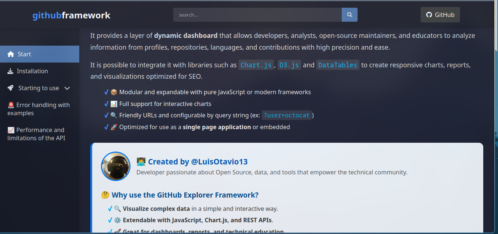

# 🚀 GitHub Explorer Framework - Documentation System


> **A powerful framework for exploring GitHub data with beautiful visualizations**

## 📌 Project Overview



This repository contains the complete documentation system for the **GitHub Explorer Framework** - a modular toolkit for:

- 🔍 Exploring GitHub profiles/repos
- 📊 Creating data visualizations
- � Building analytics dashboards

## 🏗️ Project Structure

```bash
github-framework-documentation/
├── index.html          # 📄 Main documentation page
├── style.css           # 🎨 Core stylesheet
├── banner.png          # github explorer banner
├── document.png        # preview documentation
├── script.js           # ⚙️ Main JavaScript functionality
└── README.md           # 📝 This file